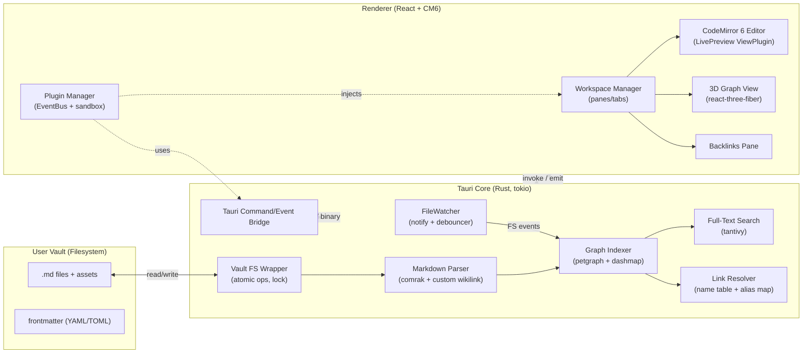
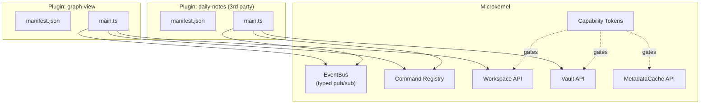

# memoview — Technical Architecture Blueprint

> An open-source, developer-focused, local-first knowledge management tool inspired by Obsidian.
> Desktop runtime: **Tauri 2** (Rust core + TypeScript/React shell). Data plane: **plain Markdown files on disk**.

---

## 0. Architectural Principles

1. **Local-first, file-first.** The user's vault (a directory of `.md` files) is the only durable source of truth. Caches, graphs, and indices are derived state and must be rebuildable from disk at any time.
2. **Microkernel core.** The Rust binary and the React shell ship the smallest possible feature set. Everything else (graph view, daily notes, even the file explorer) is a first-party plugin built on the same public API exposed to third parties.
3. **CPU-bound work in Rust, latency-bound work in TS.** Parsing, watching, indexing, full-text search, link rewriting → Rust. Editor, rendering, DnD, animation → frontend.
4. **Async, never block the UI.** All disk I/O and graph mutations happen on a tokio runtime; the renderer receives diffs over Tauri's event bus.
5. **O(Δ), not O(N).** Every reactive recompute (indexer, backlinks, search, graph) must update incrementally. Full vault scans only happen on cold start and explicit "reindex".

---

## 1. High-Level System Diagram



---

## 2. Project Layout

```
memoview/
├── src-tauri/                    # Rust core
│   ├── src/
│   │   ├── main.rs
│   │   ├── vault/                # FS wrapper, atomic ops
│   │   ├── watcher/              # notify + debouncer + coalescer
│   │   ├── parser/               # comrak ext + wikilink/frontmatter
│   │   ├── graph/                # petgraph wrapper, incremental diff
│   │   ├── resolver/             # name table, rename refactor
│   │   ├── search/               # tantivy index
│   │   ├── ipc/                  # Tauri commands + events
│   │   └── plugin_host/          # plugin perms, capability tokens
│   └── Cargo.toml
├── src/                          # React renderer
│   ├── app/                      # workspace, tabs, panes
│   ├── editor/                   # CM6 extensions, LivePreview
│   ├── graph/                    # r3f 3D graph + active-edge layer
│   ├── plugin-sdk/               # public TS types & runtime
│   ├── bus/                      # client-side EventBus
│   └── ipc/                      # typed invoke() wrappers
└── plugins/                      # first-party plugins (also third-party model)
    ├── graph-view/
    ├── daily-notes/
    └── file-explorer/
```

---

## 3. Component A — Local File System Watcher & Sync

### 3.1 Goals

- Detect create/modify/delete/rename on files and folders, cross-platform.
- Survive editor "atomic save" patterns (write-temp → rename → unlink) without emitting spurious delete+create.
- Never block the renderer or the indexer; coalesce bursts.
- Distinguish *external* writes (another editor) from *our own* writes (avoid feedback loops).

### 3.2 Library Choice

| Need | Library | Why |
|---|---|---|
| Cross-platform watch | [`notify`](https://docs.rs/notify) | inotify / FSEvents / ReadDirectoryChangesW |
| Debouncing | `notify-debouncer-full` | merges rename pairs + coalesces bursts |
| Async runtime | `tokio` | bounded mpsc, structured concurrency |
| Hashing | `blake3` | fast content-change detection |
| Concurrent maps | `dashmap` | lock-free lookups for the "ignore list" |

### 3.3 Architecture

```
┌──────────────┐  raw fs events  ┌────────────────┐  debounced  ┌─────────────┐
│  notify (OS) │ ──────────────► │ Debouncer (1s) │ ──────────► │  Coalescer  │
└──────────────┘                  └────────────────┘             └──────┬──────┘
                                                                       │
                                                  ┌────────────────────┴────────────────────┐
                                                  │                                         │
                                            ┌─────▼──────┐                          ┌───────▼──────┐
                                            │  Ignore?   │ (echo of our own write?) │   Hash diff  │
                                            └─────┬──────┘                          └───────┬──────┘
                                                  │ no                                      │ changed
                                                  └────────────────┬───────────────────────┘
                                                                   ▼
                                                        tokio::mpsc::Sender<VaultEvent>
                                                                   │
                                              ┌────────────────────┼────────────────────┐
                                              ▼                    ▼                    ▼
                                       Graph Indexer        FTS Indexer            IPC → Renderer
```

### 3.4 Rust skeleton

```rust
// src-tauri/src/watcher/mod.rs
use notify_debouncer_full::{new_debouncer, notify::*, DebounceEventResult};
use std::{path::PathBuf, time::Duration};
use tokio::sync::mpsc;

#[derive(Debug, Clone)]
pub enum VaultEvent {
    Created(PathBuf),
    Modified { path: PathBuf, hash: [u8; 32] },
    Deleted(PathBuf),
    Renamed { from: PathBuf, to: PathBuf },
}

pub struct VaultWatcher {
    tx: mpsc::Sender<VaultEvent>,
    self_writes: dashmap::DashSet<PathBuf>, // suppress feedback loops
    hashes: dashmap::DashMap<PathBuf, [u8; 32]>,
}

impl VaultWatcher {
    pub fn spawn(root: PathBuf, tx: mpsc::Sender<VaultEvent>) -> anyhow::Result<Self> {
        let watcher_state = Self {
            tx: tx.clone(),
            self_writes: dashmap::DashSet::new(),
            hashes: dashmap::DashMap::new(),
        };

        let mut debouncer = new_debouncer(
            Duration::from_millis(400),
            None,
            move |res: DebounceEventResult| {
                if let Ok(events) = res {
                    for e in events {
                        // Coalesce rename pairs, drop self-writes, hash-diff modifies.
                        Self::route(&e, &tx);
                    }
                }
            },
        )?;
        debouncer.watch(&root, RecursiveMode::Recursive)?;
        Ok(watcher_state)
    }

    /// Mark a path so the next event for it is ignored — call before our own writes.
    pub fn suppress(&self, p: &PathBuf) { self.self_writes.insert(p.clone()); }
}
```

### 3.5 Race condition & correctness notes

- **Atomic save pattern.** When VSCode/Vim writes via `tempfile → fsync → rename`, `notify` produces `Create(tmp) + Rename(tmp→real) + Modify(real)`. The debouncer merges; we still verify by **content hash** before re-indexing.
- **Self-write suppression.** `VFS::write()` adds the target to `self_writes` *before* opening the file and removes it after the watcher delivers the corresponding event (with a TTL cleanup task to avoid leaks).
- **Backpressure.** Use a **bounded** `mpsc(1024)` channel. If indexer falls behind, the watcher applies `try_send` and on `Full` switches to a "coarse" mode that emits a single "rescan-range" event for the affected subtree.
- **Symlinks/junctions.** Ignored by default; opt-in per-vault to prevent cycles.

---

## 4. Component B — In-Memory Graph Indexer (with 3D Visualization)

### 4.1 Data structures

A vault is modeled as a **directed multigraph** where nodes are notes/files and edges are typed references.

```rust
// src-tauri/src/graph/model.rs
pub type NoteId = u32;          // dense integer assigned at first sight

pub struct Note {
    pub id: NoteId,
    pub path: PathBuf,           // absolute path on disk
    pub title: String,           // basename without ext, overridable by frontmatter
    pub aliases: Vec<String>,    // from frontmatter `aliases:`
    pub frontmatter: serde_json::Value,
    pub tags: Vec<String>,
    pub mtime: u64,
    pub content_hash: [u8; 32],
}

#[derive(Clone, Copy)]
pub enum EdgeKind { WikiLink, Embed, Tag, MdLink }

pub struct Edge {
    pub from: NoteId,
    pub to: NoteId,
    pub kind: EdgeKind,
    pub line: u32,
    pub col: u32,
    pub raw: String,             // the literal "[[Foo|bar]]" — kept for refactors
}
```

Storage is an **adjacency list with reverse index**, kept lock-free for reads:

```rust
pub struct GraphIndex {
    notes:       DashMap<NoteId, Note>,
    by_path:     DashMap<PathBuf, NoteId>,
    by_name:     DashMap<String, SmallVec<[NoteId; 2]>>, // lower-case title + aliases
    out_edges:   DashMap<NoteId, Vec<Edge>>,  // forward links
    in_edges:    DashMap<NoteId, Vec<Edge>>,  // backlinks (denormalized)
    unresolved:  DashMap<String, SmallVec<[(NoteId, u32, u32); 4]>>, // dangling links
}
```

> Why **denormalized in_edges**? Backlinks are read on every note open; recomputing them by scanning all `out_edges` is O(E). With a denormalized copy, lookup is O(deg).

### 4.2 Markdown parsing pipeline

```mermaid
flowchart LR
    A[Raw .md bytes] --> B[Strip & parse frontmatter]
    B --> C[comrak AST<br/>(CommonMark + GFM)]
    C --> D[Custom Wikilink<br/>Inline Extension]
    D --> E[Visitor: links, embeds,<br/>tags, headings, blockrefs]
    E --> F[NoteFacts<br/>(edges + metadata)]
```

- **Frontmatter:** detect `---` or `+++` fence at byte 0; parse with `serde_yaml` / `toml`. Strip before passing body to comrak.
- **Wikilinks:** comrak doesn't ship `[[...]]`. Register a custom inline parser. The grammar handled:
  - `[[Target]]`
  - `[[Target|Display]]`
  - `[[Target#Heading]]` and `[[Target#^blockid]]`
  - `![[Target]]` → `EdgeKind::Embed`
- **Tags:** capture `#tag/nested` outside code spans.

### 4.3 Incremental update algorithm

The cardinal rule: **never re-scan the vault on a single-file change.**

```rust
// src-tauri/src/graph/incremental.rs
pub fn apply_event(g: &GraphIndex, ev: VaultEvent) -> GraphDelta {
    match ev {
        VaultEvent::Created(p) | VaultEvent::Modified { path: p, .. } => {
            let facts = parser::parse_file(&p)?;        // 1. parse only this file
            let id    = g.upsert_note(&p, &facts);      // 2. assign/reuse NoteId
            let old   = g.out_edges.get(&id).map(|e| e.clone()).unwrap_or_default();
            let new   = resolver::resolve_edges(g, id, &facts.links);

            let (added, removed) = diff_edges(&old, &new);  // 3. set diff
            for e in &removed { g.remove_edge(e); }         // 4. patch fwd + rev
            for e in &added   { g.insert_edge(e); }
            GraphDelta { node: Some(id), added, removed }
        }
        VaultEvent::Deleted(p) => {
            let id = g.by_path.remove(&p)?.1;
            let outs = g.out_edges.remove(&id).map(|x| x.1).unwrap_or_default();
            for e in &outs { g.in_edges.entry(e.to).and_modify(|v| v.retain(|x| x.from != id)); }
            // incoming edges become unresolved
            if let Some((_, ins)) = g.in_edges.remove(&id) {
                for e in ins { g.unresolved.entry(g.notes[&id].title.clone()).or_default().push((e.from, e.line, e.col)); }
            }
            GraphDelta { node: Some(id), added: vec![], removed: outs }
        }
        VaultEvent::Renamed { from, to } => resolver::rename(g, &from, &to),
    }
}
```

The returned `GraphDelta` is what gets emitted to the renderer — never the full graph.

### 4.4 3D Visualization

The Rust side ships only **deltas** and a `snapshot()` command. The renderer owns the 3D scene.

**Library choice:** [`react-three-fiber`](https://r3f.docs.pmnd.rs/) + [`three-forcegraph`](https://github.com/vasturiano/3d-force-graph) for layout, or a hand-rolled force-directed layout running inside a Web Worker via `wasm-bindgen` if perf matters at >50k nodes.

```tsx
// src/graph/Graph3D.tsx
import { Canvas } from '@react-three/fiber';
import ForceGraph3D from 'react-force-graph-3d';
import { useGraphStore, useOpenNoteIds } from '../state';

export function Graph3D() {
  const { nodes, links } = useGraphStore(s => s.snapshot);
  const openIds = useOpenNoteIds();              // notes the user has open right now
  const activeLinkSet = useMemo(
    () => new Set(links.filter(l => openIds.has(l.source) || openIds.has(l.target))
                       .map(l => `${l.source}->${l.target}`)),
    [links, openIds],
  );

  return (
    <ForceGraph3D
      graphData={{ nodes, links }}
      nodeId="id"
      nodeLabel={(n: any) => n.title}
      nodeOpacity={n => (openIds.has(n.id) ? 1.0 : 0.35)}
      linkColor={(l: any) => activeLinkSet.has(`${l.source.id}->${l.target.id}`)
                              ? '#7dd3fc'    // bright cyan: connected to an open note
                              : '#555'}      // dim default
      linkWidth={(l: any) => activeLinkSet.has(`${l.source.id}->${l.target.id}`) ? 2 : 0.4}
      linkDirectionalParticles={(l: any) => activeLinkSet.has(`${l.source.id}->${l.target.id}`) ? 2 : 0}
      onNodeClick={(n: any) => workspace.openNote(n.id)}
    />
  );
}
```

**"Show connected lines of opened notes"** — implemented above by intersecting the open-notes set with each edge endpoint set; matching edges get bright color, particles, and full width. The rest of the graph dims to provide visual focus.

For incremental updates, the store reducer patches `nodes`/`links` from `GraphDelta` events without rebuilding the whole array — `three-forcegraph` accepts in-place mutation when given a stable reference.

---

## 5. Component C — Editor (CodeMirror 6 + Live Preview)

### 5.1 Why CodeMirror 6

- Fully tree-shakeable, ESM-first.
- Decorations and ViewPlugins make Live Preview tractable.
- `@lezer/markdown` parser exposes a tree that we extend (custom wikilink, math, etc.).
- Excellent Vim/Emacs keymaps if the user wants them.

### 5.2 Editor composition

```ts
// src/editor/createEditor.ts
import { EditorState } from '@codemirror/state';
import { EditorView, keymap, drawSelection } from '@codemirror/view';
import { history, defaultKeymap, historyKeymap } from '@codemirror/commands';
import { markdown, markdownLanguage } from '@codemirror/lang-markdown';
import { syntaxHighlighting, defaultHighlightStyle } from '@codemirror/language';

import { wikilinkParser } from './lang/wikilink';
import { livePreview }    from './live-preview';
import { vaultLinkHandler } from './link-handler';

export function createEditor(target: HTMLElement, initial: string, path: string) {
  return new EditorView({
    parent: target,
    state: EditorState.create({
      doc: initial,
      extensions: [
        history(),
        drawSelection(),
        keymap.of([...defaultKeymap, ...historyKeymap]),
        markdown({
          base: markdownLanguage,
          extensions: [wikilinkParser],   // lezer-markdown extension below
        }),
        syntaxHighlighting(defaultHighlightStyle),
        livePreview(),                    // see 5.4
        vaultLinkHandler(path),           // cmd+click on [[wiki]]
      ],
    }),
  });
}
```

### 5.3 Wikilink as a Lezer extension

```ts
// src/editor/lang/wikilink.ts
import { MarkdownConfig } from '@lezer/markdown';

export const wikilinkParser: MarkdownConfig = {
  defineNodes: ['Wikilink', 'WikilinkMark', 'WikilinkTarget'],
  parseInline: [{
    name: 'Wikilink',
    parse(cx, next, pos) {
      // detect "[[", scan until "]]", emit nested nodes
      if (next !== 91 /* "[" */ || cx.char(pos + 1) !== 91) return -1;
      const end = cx.slice(pos, cx.end).indexOf(']]');
      if (end < 0) return -1;
      const elts = [
        cx.elt('WikilinkMark', pos, pos + 2),
        cx.elt('WikilinkTarget', pos + 2, pos + end),
        cx.elt('WikilinkMark', pos + end, pos + end + 2),
      ];
      return cx.addElement(cx.elt('Wikilink', pos, pos + end + 2, elts));
    },
    before: 'Link',
  }],
};
```

### 5.4 Live Preview implementation

The trick: at any moment, lines that **don't contain the cursor** should render their markdown syntax as styled HTML, while the line(s) the cursor is on render the raw source for editing.

```ts
// src/editor/live-preview.ts
import { ViewPlugin, Decoration, DecorationSet, EditorView, ViewUpdate, WidgetType } from '@codemirror/view';
import { RangeSetBuilder } from '@codemirror/state';
import { syntaxTree } from '@codemirror/language';

class WikilinkWidget extends WidgetType {
  constructor(readonly target: string, readonly display: string) { super(); }
  toDOM() {
    const a = document.createElement('a');
    a.className = 'cm-wikilink';
    a.dataset.target = this.target;
    a.textContent = this.display;
    return a;
  }
  eq(o: WikilinkWidget) { return o.target === this.target && o.display === this.display; }
}

export const livePreview = () => ViewPlugin.fromClass(class {
  decorations: DecorationSet;
  constructor(v: EditorView) { this.decorations = this.build(v); }
  update(u: ViewUpdate) {
    if (u.docChanged || u.selectionSet || u.viewportChanged) {
      this.decorations = this.build(u.view);
    }
  }
  build(view: EditorView): DecorationSet {
    const b = new RangeSetBuilder<Decoration>();
    const cursor = view.state.selection.main.head;
    const cursorLine = view.state.doc.lineAt(cursor).number;

    for (const { from, to } of view.visibleRanges) {
      syntaxTree(view.state).iterate({
        from, to,
        enter: (node) => {
          // Don't hide syntax on the cursor's line — keep it editable.
          const line = view.state.doc.lineAt(node.from).number;
          if (line === cursorLine) return;

          if (node.name === 'Wikilink') {
            const raw = view.state.doc.sliceString(node.from, node.to);
            const inner = raw.slice(2, -2);
            const [target, display] = inner.includes('|')
              ? inner.split('|', 2) as [string, string]
              : [inner, inner];
            b.add(node.from, node.to,
              Decoration.replace({ widget: new WikilinkWidget(target.trim(), display.trim()) }));
          }

          if (node.name === 'StrongEmphasis') {
            // hide the ** markers, leave the inner text bold via a Mark decoration
            const len = (node.name === 'StrongEmphasis') ? 2 : 1;
            b.add(node.from,         node.from + len, Decoration.replace({}));
            b.add(node.to   - len,   node.to,         Decoration.replace({}));
            b.add(node.from + len,   node.to   - len, Decoration.mark({ class: 'cm-bold' }));
          }
          // …same pattern for Emphasis, Strikethrough, InlineCode, Link, Image, Heading marks…
        },
      });
    }
    return b.finish();
  }
}, { decorations: v => v.decorations });
```

Key correctness points:

- **`Decoration.replace`** swaps source for a widget; **`Decoration.mark`** keeps source visible but applies a CSS class. Live Preview uses `replace` for syntax markers and widgets for things like wikilinks/embeds.
- The view rebuilds decorations only on `docChanged | selectionSet | viewportChanged`, so it stays cheap.
- **Widget reuse:** the `eq()` method must return `true` for equivalent widgets so CM reuses DOM and avoids reflow during typing.
- **Embeds (`![[image.png]]`)** become an `EmbedWidget` that renders an `` whose `src` is resolved by the Rust-side `vault://` asset protocol.

### 5.5 Bridging editor changes back to disk

The editor never writes to disk directly. It debounces edits and invokes:

```ts
const save = debounce((path: string, doc: string) =>
  invoke('vault_write', { path, content: doc, hash: blake3(doc) }), 250);
```

Rust verifies the precondition hash against its current cache (optimistic concurrency), writes atomically (`tempfile + rename + fsync`), and adds the path to the watcher's suppression set so it doesn't echo back.

---

## 6. Component D — Referential Integrity Engine

### 6.1 Backlinks query (already free)

Because the indexer maintains `in_edges`, displaying backlinks for the active note is:

```rust
#[tauri::command]
fn backlinks_for(graph: State<GraphIndex>, id: NoteId) -> Vec<BacklinkRef> {
    graph.in_edges.get(&id)
        .map(|edges| edges.iter().map(|e| BacklinkRef {
            from: e.from,
            line: e.line,
            col:  e.col,
            context_snippet: graph.snippet_around(e.from, e.line),
        }).collect())
        .unwrap_or_default()
}
```

For "unresolved mentions" (the typical Obsidian feature), join `unresolved` on the active note's title and aliases.

### 6.2 Rename refactor algorithm

When the user renames a note (UI or filesystem), we must:

1. Rename the file on disk atomically.
2. Update graph metadata.
3. Rewrite **every** `[[Old Name]]`, `[[Old Name|alias]]`, `[[Old Name#heading]]`, `![[Old Name]]` in every other note that linked to it — including ambiguity-aware resolution.

```rust
// src-tauri/src/resolver/rename.rs
pub fn rename(g: &GraphIndex, from: &Path, to: &Path) -> anyhow::Result<RenameReport> {
    let id = g.by_path.get(from).map(|r| *r).context("not in vault")?;
    let old_title = path_to_title(from);
    let new_title = path_to_title(to);

    // 1. atomic FS rename (suppress watcher echo)
    vfs::rename_atomic(from, to)?;

    // 2. update graph node
    {
        let mut note = g.notes.get_mut(&id).unwrap();
        note.path  = to.to_path_buf();
        note.title = new_title.clone();
        g.by_path.remove(from);
        g.by_path.insert(to.to_path_buf(), id);
        g.by_name.entry(old_title.to_lowercase()).and_modify(|v| v.retain(|x| *x != id));
        g.by_name.entry(new_title.to_lowercase()).or_default().push(id);
    }

    // 3. find inbound references via the reverse index — O(deg), not O(N)
    let refs = g.in_edges.get(&id).map(|r| r.clone()).unwrap_or_default();

    // Group by source so we open each file once.
    let mut by_source: HashMap<NoteId, Vec<Edge>> = HashMap::new();
    for e in refs { by_source.entry(e.from).or_default().push(e); }

    let mut report = RenameReport::default();
    for (source_id, edges) in by_source {
        let src_path = g.notes.get(&source_id).unwrap().path.clone();
        let original = vfs::read_to_string(&src_path)?;
        let rewritten = rewrite_wikilinks(&original, &edges, &old_title, &new_title);
        if rewritten != original {
            vfs::write_atomic(&src_path, &rewritten)?;     // suppression already inside vfs
            report.files_rewritten += 1;
            report.occurrences     += edges.len() as u32;
        }
    }

    // 4. re-resolve in case any "unresolved" links now match the new title
    g.resolve_pending(&new_title.to_lowercase());

    Ok(report)
}
```

The actual byte-level rewrite preserves alias, heading anchor, and embed markers:

```rust
fn rewrite_wikilinks(src: &str, edges: &[Edge], old: &str, new: &str) -> String {
    // edges carry exact byte spans (Edge.line/col + Edge.raw.len)
    // We sort spans descending so earlier edits don't shift later offsets.
    let mut spans: Vec<(usize, usize, String)> = edges.iter().map(|e| {
        let start = byte_offset(src, e.line, e.col);
        let end   = start + e.raw.len();
        let new_raw = e.raw.replacen(old, new, 1);   // keep alias/anchor intact
        (start, end, new_raw)
    }).collect();
    spans.sort_by(|a, b| b.0.cmp(&a.0));

    let mut out = src.to_string();
    for (s, e, replacement) in spans { out.replace_range(s..e, &replacement); }
    out
}
```

Why this is safe:

- We rely on **byte spans stored on the Edge**, not on a global text search. Pure string-replace of `[[Old Name]]` would break across files where "Old Name" appears in code blocks, frontmatter, or as substring inside another wikilink target.
- The graph guarantees we visit only files that actually link to the renamed note (via `in_edges`).
- Atomic rename + write + watcher suppression prevent feedback loops.
- A two-phase commit pattern (collect rewrites in memory, then flush) means a parse failure on file *N* doesn't leave the vault half-renamed; we abort and roll back the FS rename.

### 6.3 Ambiguity & case-insensitive resolution

`by_name` is keyed by lowercase title and stores `SmallVec<NoteId>`. When a link `[[Foo]]` resolves to multiple notes:

1. Prefer same-folder match.
2. Then exact-case match.
3. Then most-recently-modified.

This deterministic order is exposed to plugins so they can override (e.g., a "shortest path" plugin for cross-folder priority).

---

## 7. Component E — Microkernel Plugin Architecture

### 7.1 Design



**Everything is a plugin** — including the graph view, file explorer, and command palette. The shell only ships the workspace shell, the editor host, and the IPC bridge.

### 7.2 Plugin manifest

```json
{
  "id": "daily-notes",
  "name": "Daily Notes",
  "version": "1.0.0",
  "main": "main.js",
  "minAppVersion": "0.1.0",
  "permissions": [
    "vault:read",
    "vault:write:{folder:Daily}",
    "workspace:openNote",
    "ui:ribbon",
    "ui:commands"
  ],
  "settings": "settings.json"
}
```

The capability tokens are validated by the Rust core when a plugin invokes an IPC command. A plugin asking for `vault:write` without a glob scope is granted only after explicit user consent on first install.

### 7.3 Plugin API surface (TypeScript)

```ts
// src/plugin-sdk/index.ts
export interface Plugin {
  onload(app: App): void | Promise<void>;
  onunload(): void | Promise<void>;
}

export interface App {
  vault:         VaultAPI;
  workspace:     WorkspaceAPI;
  metadataCache: MetadataAPI;
  commands:      CommandAPI;
  ui:            UIAPI;
  bus:           EventBus;
}

export interface VaultAPI {
  read(path: string): Promise<string>;
  write(path: string, content: string): Promise<void>;       // perm-gated
  create(path: string, content: string): Promise<TFile>;
  delete(path: string): Promise<void>;
  rename(from: string, to: string): Promise<void>;           // triggers refactor
  list(folder?: string): Promise<TFile[]>;
  on(ev: 'create'|'modify'|'delete'|'rename', cb: (f: TFile) => void): Disposable;
}

export interface MetadataAPI {
  getFileCache(path: string): FileCache | null;
  getBacklinksFor(path: string): BacklinkRef[];
  resolveLink(linkText: string, sourcePath: string): TFile | null;
  on(ev: 'resolve'|'changed', cb: (path: string) => void): Disposable;
}

export interface WorkspaceAPI {
  getActiveFile(): TFile | null;
  openLinkText(text: string, source: string, newLeaf?: boolean): Promise<void>;
  splitActiveLeaf(dir: 'horizontal'|'vertical'): Leaf;
  registerView(type: string, factory: ViewFactory): Disposable;
  on(ev: 'file-open'|'layout-change', cb: () => void): Disposable;
}

export interface UIAPI {
  addRibbonIcon(icon: string, title: string, fn: () => void): Disposable;
  addStatusBarItem(): HTMLElement;
  addSettingTab(tab: SettingTab): Disposable;
}

export interface CommandAPI {
  add(cmd: Command): Disposable;
  run(id: string): Promise<void>;
}
```

### 7.4 EventBus

```ts
// src/bus/EventBus.ts
type Handler<T> = (payload: T) => void;
export class EventBus {
  private map = new Map<string, Set<Handler<any>>>();

  on<T>(ev: string, fn: Handler<T>): () => void {
    if (!this.map.has(ev)) this.map.set(ev, new Set());
    this.map.get(ev)!.add(fn);
    return () => this.map.get(ev)!.delete(fn);
  }

  emit<T>(ev: string, payload: T): void {
    // Snapshot — handlers may unsubscribe during dispatch.
    const handlers = this.map.get(ev);
    if (!handlers) return;
    for (const h of [...handlers]) {
      try { h(payload); }
      catch (e) { console.error(`[bus:${ev}]`, e); }   // isolate plugin crashes
    }
  }
}
```

Core events emitted by the kernel:

| Event | Payload | Source |
|---|---|---|
| `vault:file-created`  | `TFile`              | Rust watcher → IPC bridge |
| `vault:file-modified` | `TFile` + hash       | Rust watcher |
| `vault:file-renamed`  | `{ from, to }`       | Rust resolver |
| `metadata:resolved`   | `path`               | Rust indexer after parse |
| `graph:delta`         | `GraphDelta`         | Rust graph |
| `workspace:file-open` | `TFile`              | Workspace manager |
| `editor:change`       | `{ path, range }`    | CM6 plugin |

### 7.5 Loading & sandboxing

```ts
// src/plugin-sdk/loader.ts
export async function loadPlugin(manifest: Manifest, app: App): Promise<Plugin> {
  // 1. Verify capability requests against user-approved grants.
  await PermissionService.assertGrants(manifest);

  // 2. Fetch the plugin bundle and load it as an ES module.
  const url = `vault-asset://plugins/${manifest.id}/${manifest.main}`;
  const mod = await import(/* @vite-ignore */ url);
  const plugin: Plugin = new mod.default();

  // 3. Hand it a capability-scoped App proxy that adds plugin-id to every IPC call.
  const scoped = createScopedApp(app, manifest.id, manifest.permissions);
  await plugin.onload(scoped);
  return plugin;
}
```

**Trust tiers:**
- **First-party** plugins run in-process with the full API.
- **Third-party** plugins also run in-process (matching Obsidian's model) but every Rust-side IPC call carries the plugin id; sensitive operations check the capability ACL.
- **Hardened mode** (opt-in): third-party plugin module is loaded inside a `<webview>` or `Worker` with the API surface bridged via `postMessage`. Trades performance for true isolation.

### 7.6 Worked plugin example

```ts
// plugins/word-count/main.ts
import { Plugin, App } from 'memoview';

export default class WordCount implements Plugin {
  private dispose: Array<() => void> = [];
  private el!: HTMLElement;

  async onload(app: App) {
    this.el = app.ui.addStatusBarItem();
    const update = async () => {
      const f = app.workspace.getActiveFile();
      if (!f) { this.el.textContent = ''; return; }
      const text  = await app.vault.read(f.path);
      const count = text.trim().split(/\s+/).filter(Boolean).length;
      this.el.textContent = `${count} words`;
    };
    this.dispose.push(app.workspace.on('file-open', update));
    this.dispose.push(app.bus.on('editor:change', update));
    await update();
  }
  async onunload() { this.dispose.forEach(d => d()); }
}
```

---

## 8. Performance & Memory Strategy

| Concern | Strategy |
|---|---|
| **Cold start on 50k-note vault** | Parallel parse with `rayon`; build graph in a `Vec<Note>` first, then convert to `DashMap` (avoids contention). Persist a binary snapshot of the graph (`bincode`) for warm start; verify by comparing per-file mtime+hash, reparse only stale files. |
| **Memory** | Intern strings (`string-interner` crate) for titles/tags. Use `u32` ids, not `String` ids. `SmallVec` for typically-tiny edge lists. |
| **UI smoothness** | Renderer never holds the full graph — only deltas + windowed viewports. Backlinks pane uses virtualization (react-virtual). |
| **Search** | tantivy index, also incrementally updated. Query latency target < 30 ms for 100k notes. |
| **3D graph at scale** | Run force layout off the main thread (web worker). Switch from `react-force-graph-3d` to raw three.js + instanced meshes at >10k nodes. LOD: collapse clusters below a zoom threshold. |
| **Editor** | CM6 viewport rendering handles huge docs; live-preview decorations only built over `view.visibleRanges`. |

---

## 9. Step-by-Step Implementation Roadmap

> Each milestone is independently shippable and dogfoodable.

### M1 — Skeleton (week 1)
- `cargo create-tauri-app` with Vite + React + TS.
- Vault picker dialog → store last vault in app config dir.
- Basic file tree (read-only) + open-in-tab.
- IPC commands: `vault_list`, `vault_read`.
- **Done when:** you can open a vault and read a .md file.

### M2 — Editor MVP (week 2)
- Add CM6 with markdown lang.
- `vault_write` IPC (atomic, hash-checked).
- Wire debounced save on edit.
- Basic theme + keymap.
- **Done when:** you can edit a note and changes persist.

### M3 — Watcher + Hot Reload (week 3)
- Integrate `notify` + debouncer.
- Self-write suppression set.
- Emit `vault:*` events to renderer; renderer reconciles open editors.
- **Done when:** editing the same file in VSCode hot-reloads in memoview.

### M4 — Parser + Graph Core (week 4-5)
- comrak with custom wikilink inline.
- Frontmatter strip + parse.
- Build `GraphIndex` incrementally.
- IPC: `graph_snapshot`, event `graph:delta`.
- **Done when:** opening a vault produces a complete in-memory graph; renaming a file updates only deltas.

### M5 — Live Preview (week 6)
- Lezer wikilink extension.
- `livePreview()` ViewPlugin with widgets for wikilinks, embeds, bold, italic, headings, code.
- `vault://` asset protocol for embeds.
- **Done when:** notes look rendered except on the active line.

### M6 — Backlinks + Rename Refactor (week 7)
- Backlinks pane UI bound to `metadata:resolved`.
- Rename API + `rewrite_wikilinks` byte-span engine.
- Two-phase commit + rollback.
- **Done when:** renaming a note updates every `[[...]]` in the vault atomically.

### M7 — 3D Graph (week 8)
- `react-force-graph-3d` integrated.
- Active-edge highlighting based on open-notes set.
- Click node → open in workspace.
- **Done when:** graph reflects vault topology and animates active links.

### M8 — Search (week 9)
- tantivy schema (path, title, body, tags).
- Incremental write on `graph:delta`.
- Command palette + global search UI.
- **Done when:** sub-50ms search across the test vault.

### M9 — Plugin API + EventBus (week 10-11)
- Define types in `src/plugin-sdk`.
- Implement `App`, `EventBus`, scoped proxy.
- Plugin loader, permission prompt UI.
- Migrate the 3D graph and file explorer to be plugins.
- **Done when:** a third-party plugin can register a command, listen for `vault:file-modified`, and read/write files within its declared scope.

### M10 — Hardening & Release
- Settings UI, hotkeys, theme system.
- Crash reporting (opt-in, local-only by default).
- Auto-update via Tauri updater.
- Sign + notarize macOS/Windows builds.

---

## 10. Risk Register

| Risk | Mitigation |
|---|---|
| Watcher misses events under heavy load (esp. Windows) | Periodic shallow rescan (mtime sweep) every 30 s as a safety net. |
| Rename refactor corrupts a file mid-batch | Two-phase commit; on any failure, rollback original FS rename and abort. |
| Plugin crashes the renderer | Wrap every handler call in try/catch; expose `pluginCrash` events; offer "disable & restart" toast. |
| 3D graph janks on huge vaults | Worker-thread layout; instanced meshes; auto-collapse to 2D mode at >25k nodes. |
| Markdown ambiguity (e.g. wikilink inside code) | Skip extraction when the AST node is inside `CodeBlock`/`InlineCode`. |
| YAML frontmatter with arbitrary user types | Treat parse failure as soft error; surface in a "vault diagnostics" panel; don't refuse to load the file. |

---

## 11. Out of Scope (v1)

- Cloud sync (Obsidian Sync analog) — leave to git, Syncthing, or future plugin.
- Mobile clients — Tauri Mobile is viable but separate roadmap.
- WYSIWYG-only mode — Live Preview is the WYSIWYG; a no-source variant is a later setting.
- Canvas/whiteboard — candidate for a v2 plugin.

---

*End of blueprint. The full implementation per this document targets ~10 weeks to M9 with a single full-time engineer, faster with two.*
